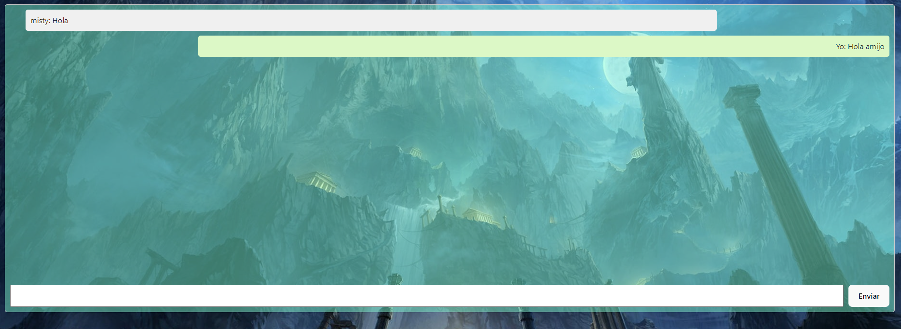

## Introducción

 En este proyecto, he creado un Frontend completo con React y Vite para una plataforma de series. Como parte de mi formación, he empleado tecnologías como React, Vite, GIT y GitHub en el desarrollo de la plataforma.

Este frontend proporciona una interfaz de usuario amigable y funcional para la plataforma de series. A continuación, encontrarás información sobre la estructura del proyecto, su funcionalidad principal, y cómo puedes contribuir o realizar la configuración del entorno de desarrollo.

Para poder ver el backend puedes acceder haciendo click aqui:
- Back: [Repositorio GitHub Back](https://github.com/Chichonicle/backend-proyecto-final.git)

## Descripción del Proyecto
 La plataforma de series es una aplicación web diseñada para facilitar el acceso a series de los años 80 y 90. Dirigida a usuarios que desean recordar una infancia o volver a ver las series que seguramente veiamos de pequeños, la plataforma ofrece una sala de chat donde los usuarios pueden compartir opiniones sobre las series que están viendo o simplemente charlar con gente que comparte tus mismos gustos y así no tener nunca la sensación de estar viendo las series tú solo, aunque nadie las esté viendo contigo en ese momento.

## Vistas

### Vistas user

- Home:

   

      
   
    

- Register:

   

      
   
    

- Login:

   

      
   
    

- Profile:

   

      
   
    

- Sala de chat:

   

      
   
    

- Vista de series:

   

      
   
    

- Visionado de series:

   

      
   
    

### Vistas Administrador

- Gestión de usuarios:

   

      
   
    

- Gestión de series:

   

      
   
    

- Cabecera:

   

      
   
    

### Tecnologias

🔧 Tecnologías

El frontend ha sido desarrollado utilizando las siguientes tecnologías: React, Vite, Javascript, HTML, CSS, GIT y GitHub.

## Deploy AWS

El proyecto ha sido deployado utilizando servicios de AWS.

 Puedes acceder al sitio desplegado [aquí](https://master.d9j3ers4zrglm.amplifyapp.com/)

 ## Futuras Mejoras

Me gustaria en un futuro poder dedicarle un poco mas de tiempo al diseño del proyecto.
También me gustaria poder añadir la sección de capitulos, para que cada serie en el momento en el que le des click al boton "Ver Serie" te redirija a la lista de capitulos de cada serie y no solo a la intro, pero ahora mismo con el tiempo que he tenido para hacer el proyecto no me ha sido posible.
Quiero también que el admin pueda borrar las series y que pueda cambiar el rol al usuario que quiera.

## Cómo Contribuir

 Si deseas contribuir a este proyecto, puedes realizar un fork del repositorio en GitHub, hacer tus cambios y enviar una solicitud de extracción (pull request). Tu contribución será revisada y, si es apropiada, se fusionará con la rama principal.

## Contacto

📧 Para cualquier pregunta o comentario, no dudes en ponerte en contacto:

- **Christian Perez Rodriguez**

## Agradecimientos

👏 Agradecimentos a Geeks Hubs Academy, a mis profesores David Ochando y Dani Tarazona por los conocimientos que he podido adquirir a lo largo de todo el bootcamp y que han hecho posible este proyecto.